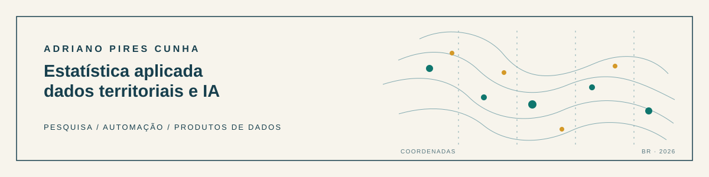

  

  Mestrando em Ciência da Computação na UFV · Bacharel em Estatística pela UFOP 
  <a href="https://www.linkedin.com/in/adriano-pires-b6a7b01a3/">LinkedIn</a> · <a href="mailto:adriano.cunha@aluno.ufop.edu.br">E-mail</a>

Trabalho com pesquisa aplicada, automação e produtos de dados. Meu foco é transformar fontes complexas em análises que sustentem decisões melhores.

## Projetos em foco

### [Consórcios MG: Dados e Território](https://github.com/driano1221/consorcios-mg-dados-territorio)
Auditoria, integração e análise territorial de dados sobre consórcios intermunicipais em Minas Gerais. R, geoprocessamento e pesquisa aplicada.

### [Radar de Consórcios](https://github.com/driano1221/radar-consorcios-whatsapp)
Monitoramento automatizado de notícias, com filtragem, controle de duplicatas e publicação no WhatsApp. Automação e curadoria de informação.

### [LeJEPA Time Series](https://github.com/driano1221/LeJEPA-TimeSeries)
Implementação e benchmark de aprendizado autossupervisionado para séries temporais, com aplicações em ECG e vibrações industriais. Python e PyTorch.

Python · R · SQL · Power BI · geoprocessamento · inferência estatística · machine learning · LLMs
